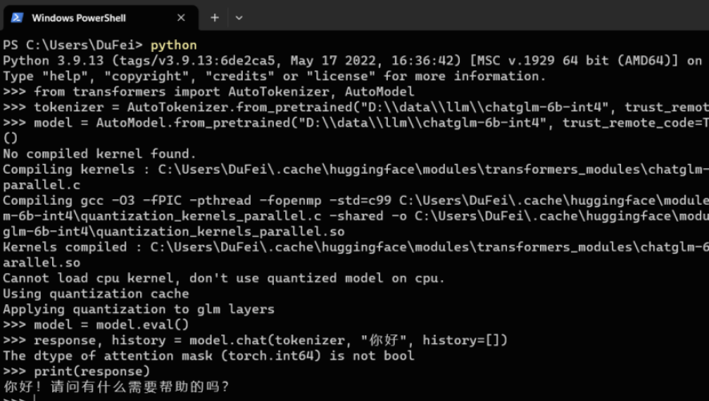
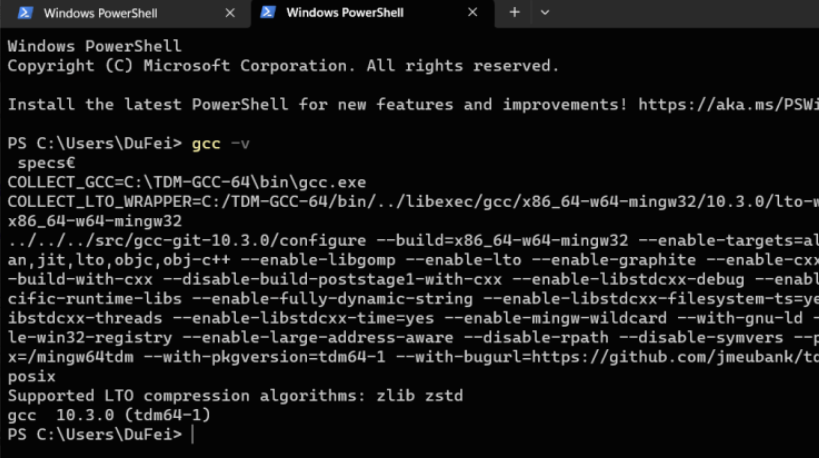
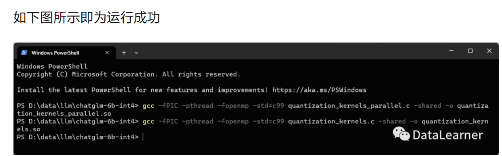
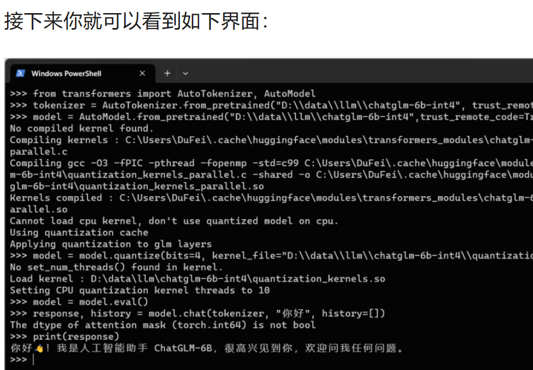

# 训练部署自己的ChatGLM-6B

参考链接：[手把手教你本地部署清华大学KEG的ChatGLM-6B模型——Windows+6GB显卡版本和CPU版本的本地部署 ](https://mp.weixin.qq.com/s/8gdrmdZfQO_Ji_frXpjc7g)

```
安装前说明
部署前安装环境
    1、下载官方代码，安装Python依赖的库
    2、下载INT4量化后的预训练结果文件
Windows+GPU部署方案
    1、Windows+GPU方案的必备条件
    2、运行部署GPU版本的INT4量化的ChatGLM-6B模型
Windows+CPU部署方案
    1、Windows+CPU方案的必备条件
    2、运行部署CPU版本的INT4量化的ChatGLM-6B模型
总结
```

---

#### 一、windows+GPU6G

1. ##### 部署前安装环境

```shell
部署前安装环境
首先，我们需要从GitHub上下载ChatGLM的requirements.txt来帮助我们安装依赖的库。
在GitHub上下载requirements.txt即可。下载地址：https://github.com/THUDM/ChatGLM-6B

安装依赖：
pip install -r requirements.txt
其中 transformers 库版本必须是4.27.1及以上的版本才可以

另外，ChatGLM-6B依赖torch，如果你有GPU，且高于6G内存，那么建议部署GPU版本，
但是需要下载支持cuda的torch，而不是默认的CPU版本的torch。


```

##### 2 下载INT4量化后的预训练结果文件

```shell
INT4量化的预训练文件下载地址：https://huggingface.co/THUDM/chatglm-6b-int4/tree/main

需要注意的是，在GitHub上，官方提供了模型在清华云上的下载地址，但是那个只包含预训练结果文件即bin文件，
但实际上ChatGLM-6B的运行需要模型的配置文件，即config.json等。
因此建议全部从HuggingFace上下载所有文件到本地。
上述文件全部下载之后保存到本地的一个目录下即可，我们保存在：D:\\chatglm-6b-int4
```

##### 3 Windows+GPU部署方案

对于ChatGLM-6B模型的训练，需要准备相应的数据集。使用ADGEN数据集，其任务为根据输入（content）生成一段广告词（summary）。下载ADGEN数据集，从 Google Drive 或者 Tsinghua Cloud 下载处理好的 ADGEN 数据集，将解压后的 AdvertiseGen 目录放到本目录下。

```shell
部署GPU版本的ChatGLM-6B需要安装cuda版本的torch，
需要检测自己的torch是否正确，可以通过如下命令检查（下面是python代码）：
import torch
print(torch.cuda.is_available())
如果以上代码输出的是True，那么恭喜你，你安装的是cuda版本的torch
（注意，有显卡也需要下载cuda和cudann安装成功才可以，这部分可以去网上找教程）。

注意，目前ChatGLM-6B有3个版本可以使用，
没有量化的版本做推理需要13G的GPU显存，INT8量化需要8GB的显存，而INT4量化的版本需要6GB的显存。
注意：模型量化会带来一定的性能损失，经过测试，ChatGLM-6B 在 4-bit 量化下仍然能够进行自然流畅的生成。
```

##### 4 运行部署GPU版本的INT4量化的ChatGLM-6B模型

```shell
GPU版本的模型部署很简单，上述两个步骤完成之后即可运行。代码如下：
from transformers importAutoTokenizer,AutoModel
tokenizer = AutoTokenizer.from_pretrained("D:\\data\\llm\\chatglm-6b-int4", trust_remote_code=True, revision="")
model =AutoModel.from_pretrained("D:\\data\\llm\\chatglm-6b-int4", trust_remote_code=True, revision="").half().cuda()
model = model.eval()
response, history = model.chat(tokenizer,"你好", history=[])
print(response)
```

通过以上步骤我们可以得到如下结果：GPU版本大约只需要1-2秒即可获得结果

 

----

#### 二、windows+CPU

##### 1. GCC编译环境配置+kernel编译

```shell
CPU版本的ChatGLM-6B部署比GPU版本稍微麻烦一点，主要涉及到一个kernel的编译问题。
在安装之前，除了上面需要安装好requirements.txt中所有的Python依赖外，torch需要安装好正常的CPU版本即可。
但是，除了这些CPU版本的安装还需要在本地的Windows下安装好C/C++的编译环境。推荐安装TDM-GCC，下载地址：https://jmeubank.github.io/tdm-gcc/
直接点击上述页面中TDM-GCC 10.3.0 release下载安装即可，注意安装的时候直接选择全部安装就好。
安装完在cmd中运行”gcc -v”测试是否成功即可。
```

 

注：安装这个主要是为了编译之前下载的文件中的`quantization_kernels.c`和`quantization_kernels_parallel.c`这两个文件。
如果在运行中遇到了如下错误提示：

```shell
No compiled kernel found.
Compiling kernels : C:\Users\DuFei\.cache\huggingface\modules\transformers_modules\chatglm-6b-int4\quantization_kernels_parallel.c
Compiling gcc -O3 -fPIC -pthread -fopenmp -std=c99 C:\Users\DuFei\.cache\huggingface\modules\transformers_modules\chatglm-6b-int4\quantization_kernels_parallel.c -shared -o C:\Users\DuFei\.cache\huggingface\modules\transformers_modules\chatglm-6b-int4\quantization_kernels_parallel.so
Kernels compiled : C:\Users\DuFei\.cache\huggingface\modules\transformers_modules\chatglm-6b-int4\quantization_kernels_parallel.so
Cannot load cpu kernel, don't use quantized model on cpu.
Using quantization cache
Applying quantization to glm layers
```

那么就是这两个文件编译出问题了。那么就需要我们手动去编译这两个文件：

即在上面下载的`D:\\data\\llm\\chatglm-6b-int4`本地目录下进入cmd，运行如下两个编译命令：

```shell
gcc -fPIC -pthread -fopenmp -std=c99 quantization_kernels.c -shared -o quantization_kernels.so
gcc -fPIC -pthread -fopenmp -std=c99 quantization_kernels_parallel.c -shared -o quantization_kernels_parallel.so
```

 

然后就可以在`D:\\data\\llm\\chatglm-6b-int4`目录下看到下面两个新的文件：

`quantization_kernels_parallel.so`和`quantization_kernels.so`。说明编译成功，后面我们手动载入即可。

##### 2. 运行部署CPU版本的INT4量化的ChatGLM-6B模型

```shell
from transformers importAutoTokenizer,AutoModel
tokenizer =AutoTokenizer.from_pretrained("D:\\data\\llm\\chatglm-6b-int4", trust_remote_code=True, revision="")
model =AutoModel.from_pretrained("D:\\data\\llm\\chatglm-6b-int4",trust_remote_code=True, revision="").float()
model = model.eval()
response, history = model.chat(tokenizer,"你好", history=[])
print(response)
```

注意，其实就是第三行代码最后的`float()`有差异：GPU版本后面是`.half().cuda()`，而这里是`float()`。

```shell
model =AutoModel.from_pretrained("D:\\data\\llm\\chatglm-6b-int4", trust_remote_code=True, revision="").float()
```

##### 3. 如果你运行上面的代码出现如下错误

```
AttributeError:'NoneType'object has no attribute 'int4WeightExtractionFloat'
```

那么就是前面说的编译文件出了问题，那么就必须做上面说的编译操作，得到那2个so文件，然后手动加载。新代码如下：

```shell
from transformers importAutoTokenizer,AutoModel
tokenizer =AutoTokenizer.from_pretrained("D:\\data\\llm\\chatglm-6b-int4", trust_remote_code=True, revision="")
model =AutoModel.from_pretrained("D:\\data\\llm\\chatglm-6b-int4",trust_remote_code=True, revision="").float()
model = model.quantize(bits=4, kernel_file="D:\\data\\llm\\chatglm-6b-int4\\quantization_kernels.so")
model = model.eval()
response, history = model.chat(tokenizer,"你好", history=[])
print(response)
```

比原来的代码多了`model = model.quantize(bits=4, kernel_file="D:\\data\\llm\\chatglm-6b-int4\\quantization_kernels.so")`一行手动加载的内容。

 

注：CPU版本的模型推理运行一次约1-2分钟，实在是太慢了，基本不适合使用。有机会还是搞GPU版本吧！
