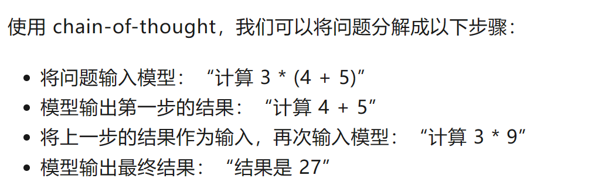

# 训练技术：Prompt-Tuning、Instruction-Tuning和Chain-of-Thought

参考链接：[大语言模型三种训练技术及区别：Prompt-Tuning、Instruction-Tuning和Chain-of-Thought](https://mp.weixin.qq.com/s?__biz=MzIwMTc4ODE0Mw==&mid=2247616263&idx=1&sn=092a7e80ec9fa8bc87922c443177e97c&chksm=96ebd887a19c519190cc432c28f076b180f83a29d1643c05c0fe98b47c3535838bf97cb5411b&scene=21#wechat_redirect)

#### 一、Prompt-Tuning：加上“prompt”，变成填空题

```
只要我们把希望输出的部分删除掉，然后尽量构造与该输出有关的其它tokens即可。这就是prompt-tuning的一种想法！
与输出相关的tokens组成的上下文信息即可理解为是一个prompt。Prompt通常是一种短文本字符串，用于指导语言模型生成响应。Prompt提供上下文和任务相关信息，以帮助模型更好地理解要求，并生成正确的输出。
简单总结就是说Prompt就是利用语言模型的生成能力帮我们完成任务。
```

----

#### 二、Instruction-Tuning介绍：更为详细流程化

```
与Prompt不同，Instruction通常是一种更详细的文本，用于指导模型执行特定操作或完成任务。Instruction可以是计算机程序或脚本，也可以是人类编写的指导性文本。Instruction的目的是告诉模型如何处理数据或执行某个操作，而不是简单地提供上下文或任务相关信息。
```

区别：Prompt和Instruction都是用于指导模型生成输出的文本，但它们的目的和使用方式是不同的。**Prompt更多地用于帮助模型理解任务和上下文，而Instruction则更多地用于指导模型执行具体操作或完成任务。**

指令微调的动机是提高语言模型对自然语言处理指令的响应能力。

这个想法是，通过使用监督来教授语言模型执行通过指令描述的任务，模型将学会遵循指令，即使是对于未见过的任务也能如此。

而OpenAI在InstructGPT中也是类似的想法！InstructGPT就是ChatGPT的前身！

例如：对于问答任务，Instruction可以提供具体的指令，例如“请回答下列问题：谁是美国第一位总统？”，并将文本段落作为输入提供给模型。

```
以InstructGPT为例，其基本流程如下：
（1）准备自然语言指令集：针对特定任务，准备一组自然语言指令，描述任务类型和任务目标，例如情感分类任务的指令可以是“该文本的情感是正面的还是负面的？”。
（2）准备训练数据集：针对特定任务，准备一个标记化的数据集，其中每个数据样本都包含输入文本和标签，例如情感分类任务的标签可以是“正面”或“负面”。
（3）将自然语言指令和数据集转换为模型输入：将自然语言指令和数据集转换为模型输入，例如对于情感分类任务，将自然语言指令和文本拼接作为输入，例如：“该文本的情感是正面的还是负面的？这家餐厅的食物很好吃。”
（4）在指令上进行微调：在指令上进行微调，以适应特定任务的需求，提高模型在任务上的性能。
这样的方式训练了出来的模型可以让模型更好地识别输入的意图，同时也在zero-shot中表现更好！
```

----

#### 三、Chain-of-Thought介绍

允许模型在多个步骤中生成连贯的回答，从而更好地解决问题或完成任务。通过思维链式方法训练大型语言模型需要将训练过程分解成较小、相互关联的任务，以帮助模型理解和生成连贯、上下文感知的响应。

在 chain-of-thought 方法中，模型的输出被视为一个序列，每个部分都是一个独立的“思考链”或步骤。模型通过将先前的输出作为后续输入的一部分来迭代地生成这些部分，这样可以让模型在一定程度上模拟人类解决问题的过程。

 

```
以GPT-3为例，以下是一些步骤，可以用Chain-of-thought方法训练一个更先进的GPT-3模型：
（1）收集大量的语料库，包括各种主题和风格的文本。可以从各种来源获取数据，如网站、社交媒体、新闻、书籍等。
（2）对语料库进行预处理，包括分词、标记化、去除停用词、处理语法结构等。
（3）定义一个上下文窗口，即模型需要考虑的前面和后面的文本内容。
（4）将训练过程分解为一系列逐步更复杂的子任务。
    例如，可以将训练过程分解为理解语法和词汇、生成单词和短语、生成连贯的句子和段落、理解上下文等子任务。
（5）为每个子任务定义适当的训练目标和损失函数，并使用训练数据来训练模型。
    例如，为了训练模型理解上下文，可以定义一个损失函数，它评估模型生成的响应与上下文的相关性。
（6）在训练完成后，使用测试数据来评估模型的性能。例如，检查模型是否能够生成连贯的响应，以及是否能够维护文本中的思维链。
（7）迭代地对模型进行微调和优化。
```

```
在Chain-of-thought训练中，将数据集中的输入分解为一系列任务是非常关键的一步。一般来说，这个过程需要根据特定的任务和数据集来进行定制。以下是一些通用的方法：
（1）首先，需要定义一个目标任务，即要求模型完成的最终任务。
     例如，如果目标任务是自然语言生成，那么数据集中的输入可能是一句话或一个段落，模型需要将其转化为自然语言响应。
（2）然后，需要将目标任务分解为一系列子任务。
    这些子任务应该是相互关联的，每个子任务的输出都可以作为下一个子任务的输入。
    例如，在自然语言生成任务中，可以将其分解为理解输入的语义、确定输出的语法结构、生成文本等子任务。
（3）每个子任务的输入和输出都需要定义。
    例如，在自然语言生成任务中，输入可能是一组与上下文相关的单词，输出可能是下一个单词或整个句子。
（4）每个子任务都需要为其定义一个训练目标和相应的损失函数。
    这些目标和损失函数应该与任务相关，并帮助模型学习与该任务相关的知识。
（5）最后，需要将所有子任务组合起来，构建一个完整的模型。每个子任务的输出都将成为下一个子任务的输入，直到完成目标任务。
```

chain-of-thought 是一种有效的技巧，可以帮助大型预训练语言模型在多步骤任务和复杂问题中生成连贯的输出。然而，在实际应用中，可能需要结合其他技巧来克服其局限性，以实现更好的性能。

----

#### 四、对比总结

Prompt-tuning、instruction-tuning和chain-of-thought都是用于训练大型语言模型的方法，它们都有助于提高模型的生成能力和上下文理解能力，但是它们的方法和目的略有不同。

- Prompt-tuning：Prompt-tuning是一种使用自然语言提示（prompt）的方法，以指导模型生成特定的输出。这种方法的目的是通过对模型进行定向训练，使其在特定任务上表现出更好的性能。与其他方法不同，Prompt-tuning的重点在于设计良好的提示，这些提示可以引导模型生成准确、上下文相关的响应。
- Instruction-tuning：Instruction-tuning是一种通过为模型提供任务相关的指令来指导模型学习的方法。这种方法的目的是使模型更好地理解任务的要求，并提高其生成能力和上下文理解能力。Instruction-tuning通常需要较少的训练数据，并且可以提高模型的泛化性能。
- Chain-of-thought：Chain-of-thought是一种通过分解训练过程为较小的相互关联的任务来训练模型的方法。这种方法的目的是使模型能够理解和维护文本中的思维链，从而生成连贯的、上下文相关的响应。与其他方法不同，Chain-of-thought的重点在于将训练过程分解为一系列逐步更复杂的任务，并使用注意机制来帮助模型集中于相关的部分。

总之，这些方法都有助于提高大型语言模型的生成能力和上下文理解能力，但是它们的方法和目的略有不同。Prompt-tuning和instruction-tuning通常用于特定任务的优化，而Chain-of-thought通常用于提高模型的生成能力和上下文理解能力。

---

##### 五、GPT-4生成的使用Instruction-Tuning微调GPT-4的案例

Instruction-tuning 是一种微调大型预训练语言模型（如 GPT-4）的方法，可以让模型根据特定任务提供指令来执行任务。在这个具体的情感分类案例中，我们将使用 instruction-tuning 来对给定的文本进行情感分析。我们的目标是根据文本内容，判断其情感是正面、负面还是中性。以下是一个简单的指南：

- ##### 准备数据集：

  首先，你需要一个带有标签的文本数据集，以便在情感分类任务上微调模型。数据集应该包含多个实例，每个实例都有一段文本和一个对应的情感标签（正面、负面或中性）。数据集可以是开源的，如 IMDB 电影评论数据集，也可以是你自己收集和标注的数据。

- ##### 数据预处理：

  将文本和情感标签转换为适用于 GPT-4 模型的格式。例如，将文本和情感标签拼接在一起，用特定的分隔符（如 “|||”）分隔。如下所示：

  ```
  文本1|||标签1
  文本2|||标签2
  文本3|||标签3
  ```

- ##### 微调 GPT-4 模型：

  使用准备好的数据集和拼接格式，对 GPT-4 模型进行 instruction-tuning。在训练过程中，模型将学习如何根据输入文本预测相应的情感标签。

- ##### 模型测试和评估：

  在微调后，使用测试数据集（不包含在训练数据集中的数据）对模型进行测试。输入文本并观察模型生成的情感标签，然后与实际标签进行比较，计算准确率、召回率等性能指标。

- ##### 使用微调后的模型进行情感分类：

  在实际应用中，当你需要对给定的文本进行情感分类时，可以这样使用微调后的 GPT-4 模型：

  ```
  输入：这部电影的剧情令人惊叹，特效也非常出色，我非常喜欢。
  输出：正面
  ```

  通过 instruction-tuning，GPT-4 模型能够根据输入文本生成对应的情感标签，从而实现情感分类任务。
