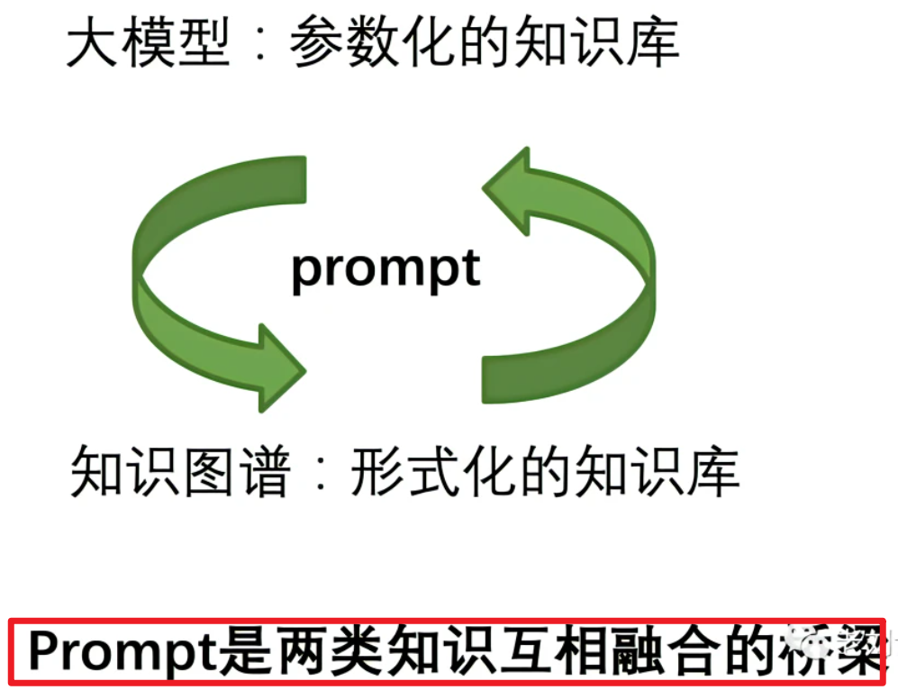

# Lamini LLM引擎学习

相关链接：[再谈知识图谱与ChatGPT如何结合：参数化与形式化知识库的现实问题、结合要素和具体路线](https://mp.weixin.qq.com/s/4PYtlyaKktghs5WxEp31_Q)

  

知识图谱，可以利用prompt，参与到大模型的训练前的数据构造，训练中的任务，以及训练后推理结果的约束生成，提升大模型的性能。

大模型，可以通过prompt，来执行相应信息提取以及思维链的推理任务，形式化成不同形式的知识【例如三元组，多元组或者事件链条】。

---

#### 1. 知识图谱VS大语言模型

相同点：知识图谱VS大语言模型本质上都是一种知识库；chatgpt遇到的事实性错误和时效性，知识图谱同样存在，知识图谱也需要解决知识更新的问题。 

##### 不同点：

##### 知识图谱是一种知识的形式化表示方式，大语言模型(ChatGPT)是参数化的知识。

知识图谱是一种知识的形式化表示方式，大语言模型(ChatGPT)是参数化的知识。

结构化知识很难构建(因为要设计知识的结构体系)，但易于推理(因为有体系结构)，非结构化知识易于构建(直接存 起来就行)，但很难用于推理(没有体系结构)。
