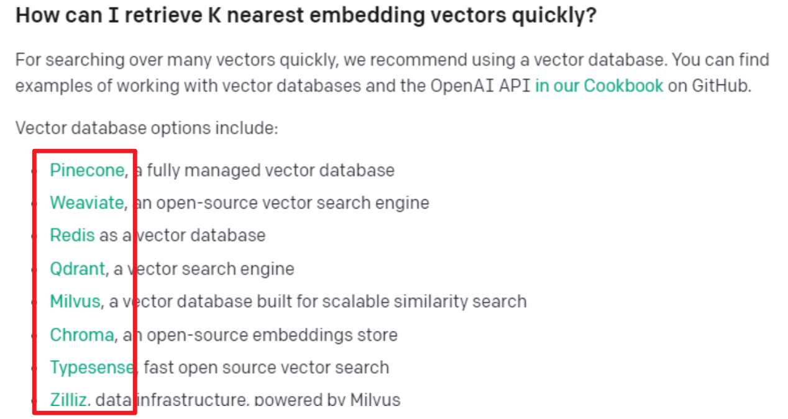

# 根据自己数据库让GPT作答

1. ##### api的token的最大是4096

   官方两种解决方案：Embeddings（嵌入）；Fine-tuning（微调）

2. ##### Fine-tuning（微调）

```
通过提供以下功能，微调可让您从API提供的模型中获得更多信息：
1 比即时设计更高质量的结果
2 能够训练更多的例子比可以在提示
3 由于更短的提示而节省令牌
4 降低延迟请求
```

微调步骤

```
步骤：
1 准备和上传培训数据
2 训练一个新的微调模型
3 使用你的微调模型
```

微调作用

```
Fine-tuning（微调）目前仅适用于以下基本型号：davinci、curie、babbage和ada，是预训练模型，一次训练终身受益，适合很久知识都不变且数据集较小的情况；你的训练示例越多越好。我们建议至少有几百个例子。一般来说，我们发现数据集大小的每一次翻倍都会导致模型质量的线性增加
```

3. ##### Embeddings（嵌入）

```
OpenAI的文本嵌入测量文本字符串的相关性。嵌入通常用于：
1 搜索（其中结果按与查询字符串的相关性进行排名）
2 聚类（其中文本字符串按相似性分组）
3 建议（其中建议包含相关文本字符串的项目）
4 异常检测（其中识别出相关性很小的离群值）
5 多样性测量（分析相似性分布）
6 分类（其中文本字符串按其最相似的标签进行分类）
```

embedding作用

```
Embeddings（嵌入）无需训练模型，是将自己的预设Pormpt+数据+问题打包，当作一整段话发送给GPT。让GPT根据这个预设的Prompt和灌给的数据再加问题做回答。适合数据量超大且实时更新的一些数据。
```

##### 简而言之：在外面包了一层语义搜索，先搜索再打包，最后发给gpt回答。

```
目前市场上出现的实时搜索基本也是先在网页搜索后将网页的内容提取出来后，一起打包发给gpt,让其回复，并没有真正的实现联网功能。
```

4. ##### 解决方案：矢量数据库

 
