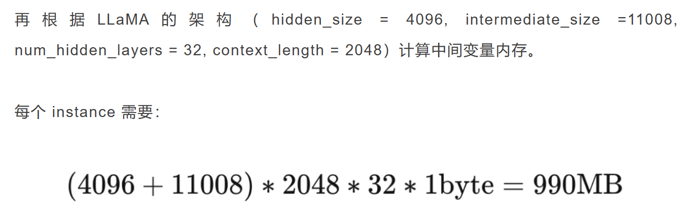
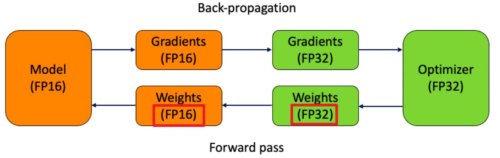
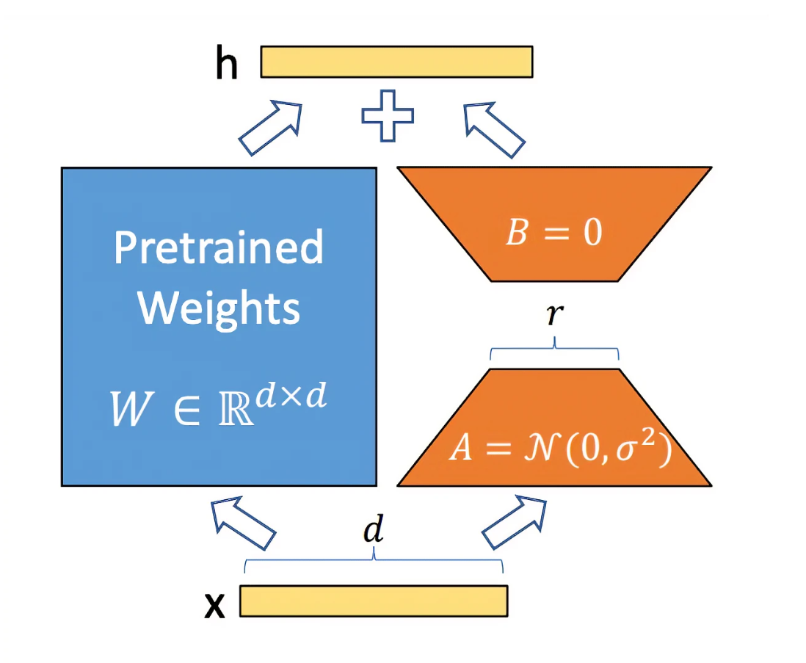
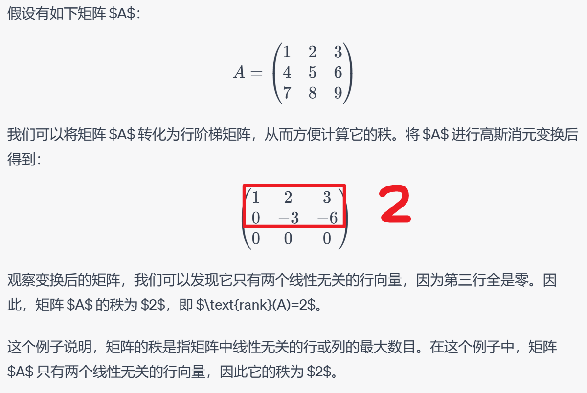
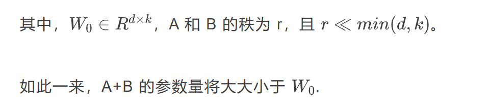

# 微调范式对比

参考链接：[有哪些省内存的大语言模型训练/微调/推理方法？](https://mp.weixin.qq.com/s?__biz=MzIwMTc4ODE0Mw==&mid=2247616263&idx=1&sn=092a7e80ec9fa8bc87922c443177e97c&chksm=96ebd887a19c519190cc432c28f076b180f83a29d1643c05c0fe98b47c3535838bf97cb5411b&scene=21#wechat_redirect)

##### 一、Memory-Efficient 的 LLMs 的训练/微调/推理方法，包括：

```
● fp16
● int8
● LoRA
● Gradient checkpointing
● Torch FSDP
● CPU offloading
```

##### 二、估算模型所需的RAM：参数个数 * 精度 * 4 + CUDA内核1.3  + [(hidden_size+intermediate_size)*context_length\*num_hidden_layers]/1024 G * batch数

根据参数量估计模型大致所需的 RAM，进而通过估算设置 batch_size，设置模型精度，选择微调方法和参数分布方法等。

（1）用 **LLaMA-6B** 模型为例估算其大致需要的内存：

```
1. 首先考虑精度对所需内存的影响：
● fp32 精度，一个参数需要 32 bits, 4 bytes.
● fp16 精度，一个参数需要 16 bits, 2 bytes.
● int8 精度，一个参数需要 8 bits, 1 byte.
```

```
2. 其次，考虑模型需要的 RAM 大致分三个部分：
● 模型参数：模型参数：等于参数量*每个参数所需内存。
	对于 fp32，LLaMA-6B 需要 6B*4 bytes = 24GB内存
	对于 int8，LLaMA-6B 需要 6B*1 byte = 6GB
● 梯度：等于参数量*每个梯度参数所需内存。
● 优化器参数：不同的优化器所储存的参数量不同。对于常用的 AdamW 来说，需要储存两倍的模型参数	（用来储存一阶和二阶momentum）。
	fp32 的 LLaMA-6B，AdamW 需要 6B*8 bytes = 48 GB
	int8 的 LLaMA-6B，AdamW 需要 6B*2 bytes = 12 GB
```

```
3. CUDA kernel 也会占据一些 RAM，大概 1.3GB 左右
	torch.ones((1，1)).to("cuda")
	print_gpu utilization()
	GPU memory occupied: 1343 MB
```

```
4. 综合1、2、3步骤，int8 精度的 LLaMA-6B 模型部分大致需要 6GB+6GB+12GB+1.3GB = 25.3GB 左右。
再根据LLaMA的架构（hidden_size = 4096, intermediate_size =11008, num_hidden_layers = 32, context_length = 2048）计算中间变量内存。
```

 

```
5. 所以一张 A100（80GB RAM）大概可以在 int8 精度；batch_size = 50 的设定下进行全参数训练【25.3+990/1024*50】。
```

---

##### 三、Fp16-mixed precision

 

1. 大致思路：在前向反馈 和 梯度计算 的时候使用 fp16 来加速，但是在更新参数时使用 fp32。
2. torch实现：torch fp16 推理直接使用 model.half() 将模型转换为fp16。

```
model.half()
```

3. 使用 Huggingface Transformers：在 TrainingArguments 里声明 fp16=True

---

##### 四、Int8-bitsandbytes量化方法

参考论文：**LLM.int8(): 8-bit Matrix Multiplication for Transformers at Scale**https://arxiv.org/abs/2208.07339*

1. Int8 是个很极端的数据类型，它最多只能表示 - 128～127 的数字，并且完全没有精度。

2. 为了在训练和 inference 中使用这个数据类型，bitsandbytes 使用了两个方法最大程度地降低了其带来的误差：
   [A Gentle Introduction to 8-bit Matrix Multiplication for transformers at scale using transformers, accelerate and bitsandbytes (huggingface.co)](https://huggingface.co/blog/hf-bitsandbytes-integration)

   （1）vector-wise quantization：矢量量化

   （2）mixed precision decompasition：混合精度反编译

    
   
3. 借助 Huggingface PEFT，使用 int8 训练 opt-6.5B 的完整流程：

   *https://github.com/huggingface/peft/blob/main/examples/int8_training/Finetune_opt_bnb_peft.ipynb*

---

##### 五、LoRA：Low-Rank Adaptation 是微调 LLMs 最常用的省内存方法之一【低秩转换】

*https://arxiv.org/pdf/2106.09685.pdf*

 

**简述原理：**微调LLM时，更新矩阵往往是低秩矩阵。（低秩矩阵是指矩阵中包含的信息可以用较低维度的子空间进行近似表示的矩阵，由于低秩矩阵在储存和计算方面都有优势，所以它们被广泛应用于压缩、降噪、特征提取、模型压缩等任务）（矩阵的秩是指矩阵中线性无关的行或列的最大数目）

 

所以LoRA 的作者根据这一特点将更新矩阵变成两个低秩矩阵的积积B . A 。

 

例子：借助 Huggingface PEFT 框架，使用 LoRA 微调 mt0：

*https://github.com/huggingface/peft/blob/main/examples/conditional_generation/peft_lora_seq2seq.ipynb*

----

##### 六、Gradient Checkpointing

在 torch 中使用 - 把 model 用一个 customize 的 function 包装一下即可，详见：

**Explore Gradient-Checkpointing in PyTorch**

*https://qywu.github.io/2019/05/22/explore-gradient-checkpointing.html*

在 Huggingface Transformers 中使用：

*https://huggingface.co/docs/transformers/v4.27.2/en/perf_train_gpu_one#gradient-checkpointing*

---

##### 七、Torch FSDP+CPU offload【分布式】

1. **原理：**Fully Sharded Data Paralle（FSDP）和 DeepSpeed 类似，均通过 ZeRO 等分布优化算法，减少内存的占用量。其将模型参数，梯度和优化器状态分布至多个 GPU 上，而非像 DDP 一样，在每个 GPU 上保留完整副本。

   CPU offload 则允许在一个 back propagation 中，将参数动态地从 GPU -> CPU, CPU -> GPU 进行转移，从而节省 GPU 内存。

2. Huggingface 这篇博文解释了 ZeRO 的大致实现方法：

* https://huggingface.co/blog/zero-deepspeed-fairscale

```
ZeRO零冗余优化器 的巧妙方法是在所有 GPU 上平均划分参数、梯度和优化器状态，并为每个 GPU 提供一个分区（也称为分片）。这导致 GPU 之间的数据存储零重叠。在运行时，每个 GPU 通过要求参与的 GPU 发送它所缺少的信息来动态构建每一层的数据。
FairScale 和 DeepSpeed 仅对优化器状态和梯度执行分区（分片）。模型参数分片应该很快就会在DeepSpeed和FairScale中推出。
ZeRO 卸载（CPU）。此功能将一些处理和内存需求卸载到主机的 CPU，从而允许更多内容适应 GPU。
```

3. 借助 torch 实现 FSDP，只需要将 model 用 FSDPwarp 一下；同样，cpu_offload 也只需要一行代码：

* https://pytorch.org/blog/introducing-pytorch-fully-sharded-data-parallel-api/

4. 在这个可以查看 FSDP 支持的模型：

* https://pytorch.org/docs/stable/fsdp.html

5. 在 Huggingface Transformers 中使用 Torch FSDP：

* https://huggingface.co/docs/transformers/v4.27.2/en/main_classes/trainer#transformers.Trainin

