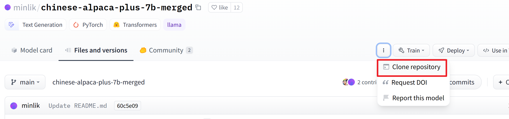
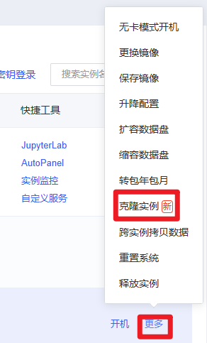
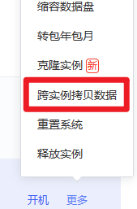

#### audoDL运行LawGPT

----

1. 租用实例：4090一卡

2. 镜像选择：pytorch2.0-py3.8版本

3. 进入autodl-tmp/，然后点击终端

4. 编辑文件+刷新，使得能使用conda，以进行后续的环境配置：
   输入：vim ~/.bashrc
   开始进行编辑：输入i
   移动到文件的最后一行，加上source /root/miniconda3/etc/profile.d/conda.sh
   保存并退出：按Esc键，输入:wq，再回车
   输入bash重启终端（即，刷新一下）

5. 创建虚拟环境路径：conda create --prefix /root/autodl-tmp/python310/

   创建新环境：conda create -n py310 python=3.10
   进入新环境，输入：conda activate py310

6. 进入新路径：mkdir gpt-test           cd gpt-test  
   git：git clone https://github.com/pengxiao-song/LaWGPT.git  cd LaWGPT
   安装依赖：pip install -r requirements.txt
   报错：
    
   原因：github访问不上（在开vpn+中心网络情况下，安装成功）
   解决方法：pip install -t 7200 -r requirements.txt

7. pip list 检查是否安装成功

8. 运行bash scripts/webui.sh，但是报错：ModuleNotFoundError: No module named 'fire'，继续pip安装，最后还要记得安装sentencepiece，以及requirements中没有安装的库

9. 全部安装完毕，打开gpu，然后bash scripts/webui.sh

10. 运行失败，因为无法访问hf（莫名其妙的bug），明明可以ping通

11. 离线下载base_model（[minlik/chinese-alpaca-plus-7b-merged at main (huggingface.co)](https://huggingface.co/minlik/chinese-alpaca-plus-7b-merged/tree/main?clone=true)）和lora权重（[entity303/lawgpt-lora-7b-v2 at main (huggingface.co)](https://huggingface.co/entity303/lawgpt-lora-7b-v2/tree/main)）到本地 ，然后xftp传输到云端
    

cmd：

----

克隆流程：

1. 系统盘
    
2. 数据盘

 

3. 进入到law-gpt目录：conda activate

4. 