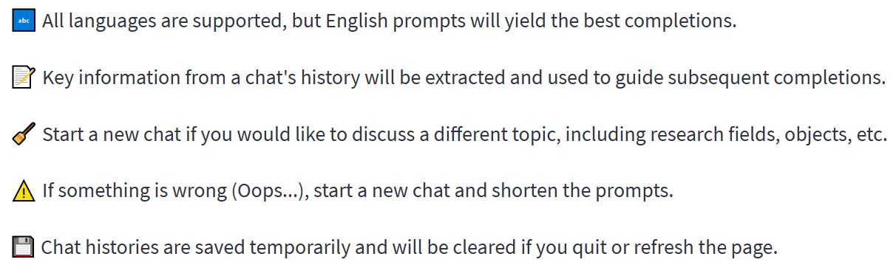
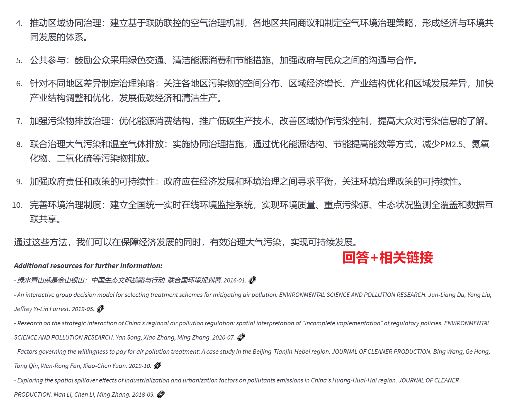
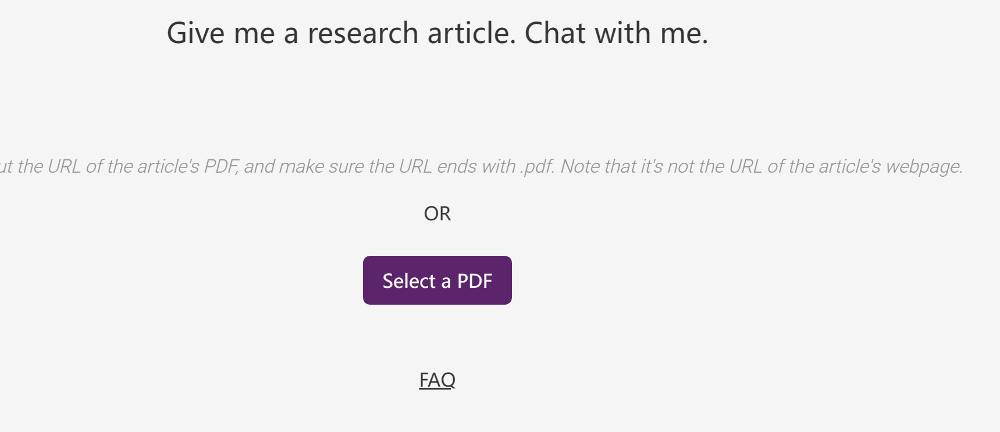
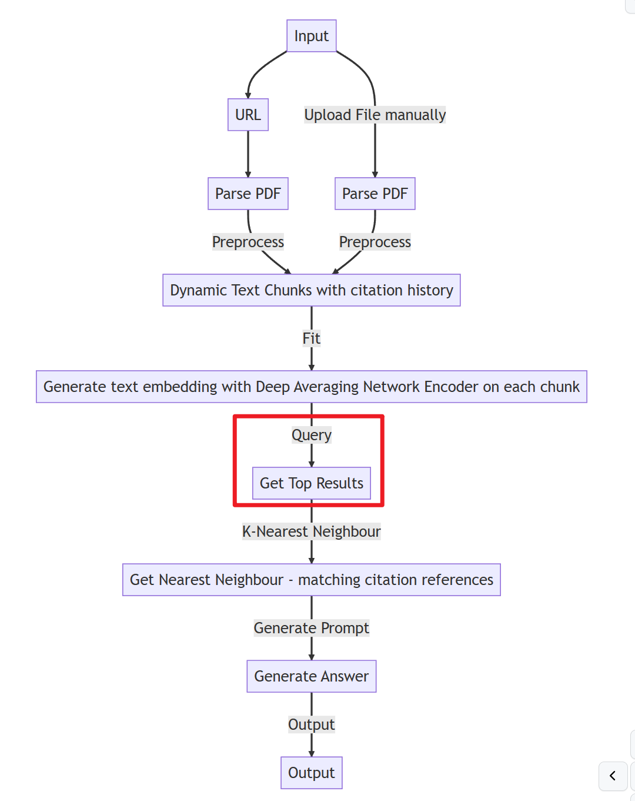

# 天工GPT调研

相关链接：
[天工Chat上新了](https://blog.csdn.net/v_JULY_v/article/details/129709105)

[TianGong GPT](https://gpt.tiangong.world/en)

---

#### 一、天工Chat：[TianGong Chat](https://chat.tiangong.world/)【领域微调是重点】

1. 概述：主体是一个基于环境工程、生态学相关领域	语料微调训练得到的一个GPT模型，提供Chat页面。
2. 主要特点：从提问中抽取出关键信息，然后进行知识库匹配。
    

3. 实测体验：速度较慢，生成效果如下，可以看到主要包括文本信息+相关扩展链接。

----

#### 二、天工GPT：[天宫 (tiangong.world)](https://gpt.tiangong.world/en)【开源ChatPDF套壳】

 

1. 概述：一个典型的ChatPDF类似应用，类似相关项目很多如：
   [https://www.chatpdf.com](https://www.chatpdf.com/)
   [Ask Your PDF - Interactive PDF Conversations powered by ChatGPT](https://askyourpdf.com/)

2. 主要的实现原理：将文章进行分割，然后与query进行查询匹配，将相关段落返回，输入到GPT中得到最后的答案。
    

