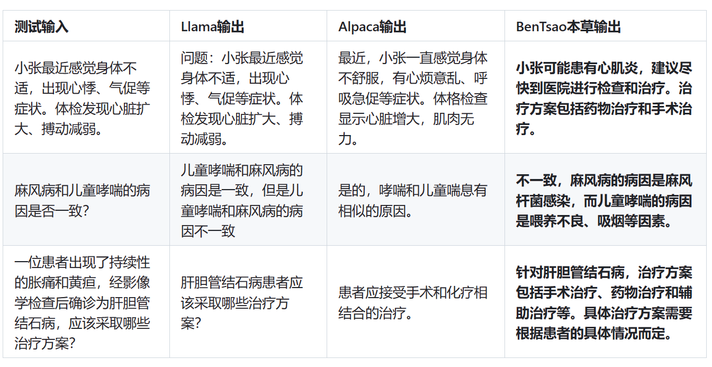

# 垂直领域GPT微调模型介绍

#### 一、本草医学GPT模型：基于中文医学知识的LLaMA微调模型

github链接：https://github.com/SCIR-HI/Huatuo-Llama-Med-Chinese

1. 概述

   本草 是经过中文医学指令精调/指令微调(Instruct-tuning) 的LLaMA-7B模型，由哈尔滨工业大学社会计算与信息检索研究中心健康智能组完成。项目组通过 医学知识图谱 和 GPT3.5 API 构建了中文医学指令数据集，并在此基础上对LLaMA进行了指令微调，提高了LLaMA在医疗领域的问答效果。

2. 使用展示
    

3. 数据集

项目组采用了公开和自建的中文医学知识库方式，主要参考了cMeKG (https://github.com/king-yyf/CMeKG_tools)，并利用 GPT3.5接口围绕医学知识库构建问答数据，设置了多种Prompt形式来充分利用知识。医学知识库围绕疾病、药物、检查指标等构建，字段包括并发症，高危因素，组织学检查，临床症状，药物治疗，辅助治疗等。知识库示例如下：

```
{"中心词": "偏头痛", "相关疾病": ["妊娠合并偏头痛", "恶寒发热"], "相关症状": ["皮肤变硬", "头部及眼后部疼痛并能听到连续不断的隆隆声", "晨起头痛加重"], "所属科室": ["中西医结合科", "内科"], "发病部位": ["头部"]}
```

4. 指令微调数据集：QA数据集

   ```
   "问题：一位年轻男性长期使用可卡因，突然出现胸痛、呕吐、出汗等症状，经检查发现心电图反映心肌急性损伤，请问可能患的是什么疾病？治疗方式是什么？"
   回答: 可能患的是心肌梗塞，需要进行维拉帕米、依普利酮、硝酸甘油、ß阻滞剂、吗啡等药物治疗，并进行溶栓治疗、低分子量肝素、钙通道阻滞剂等辅助治疗。此外需要及时停用可卡因等药物，以防止病情加重。"
   ```

5. 此外，项目组还收集了2023年关于肝癌疾病的中文医学文献，利用GPT3.5接口围绕医学文献多轮问答数据（1k条左右）。

6. 模型训练与微调**【后续进行微调可借鉴】**

支持使用自己的数据集进行微调，只需要按照./data/llama_data.json的格式构建自己的数据集，然后执行命令：

```
bash ./scripts/finetune.sh
```

项目组在一张A100-SXM-80GB显卡上进行了训练，训练总轮次10轮，耗时大约2h17m。batch_size=128的情况下显存占用了40G左右。也可以使用3090/4090显卡，显存在24GB以上时，可以获得较好的效果。

----

#### 二、LaWGPT 中文法律知识模型

github链接：https://github.com/pengxiao-song/LaWGPT/

1. 概述：
   LaWGPT 是一系列基于中文法律知识的开源大语言模型，该系列模型在通用中文基座模型（如 Chinese-LLaMA、ChatGLM 等）的基础上扩充法律领域专有词表、**大规模中文法律语料预训练**，增强了大模型在法律领域的基础语义理解能力。在此基础上，**构造法律领域对话问答数据集、中国司法考试数据集进行指令精调**，提升了模型对法律内容的理解和执行能力。

2. 数据集

​	训练数据主要分为两个部分：1.律师和用户之间的情景对话； 2.对特定法律知识的问答。

```txt
question:朋友欠钱不还咋办
answers: ['欠款金额是多少 ', '多少钱呢', '律师费诉讼费都非常少都很合理，一定要起诉。', '大概金额多少？', '需要看标的额和案情复杂程度，建议细致面谈']
*******************************************************
question:昨天把人家车刮了,要赔多少
answers: ['您好，建议协商处理，如果对方告了你们，就只能积极应诉了。', '您好，建议尽量协商处理，协商不成可起诉']
*******************************************************
```

知识问答数据集包括针对Self-Instruct的可靠性和安全性漏洞，使用了基于特定知识的**Reliable-Self-Instruction**：通过提供具体的法律知识文本，先让ChatGPT生成与该段法律知识内容与逻辑关系相关的若干问题，再通过“文本段-问题”对的方式让ChatGPT回答问题，从而使ChatGPT能够生成含有法律信息的回答，保证回答的准确性。**【后续可参考该方法构建问答数据集】**

3. ##### 模型训练【后续可参考】

   （1）LawGPT 系列模型的训练过程分为两个阶段：

   1. 第一阶段：扩充法律领域词表，在大规模法律文书及法典数据上预训练 Chinese-LLaMA
   2. 第二阶段：构造法律领域对话问答数据集，在预训练模型基础上指令精调。

4. ##### 计算资源

   8 张 Tesla V100-SXM2-32GB ：二次训练阶段耗时约 24h / epoch，微调阶段耗时约 12h / epoch
