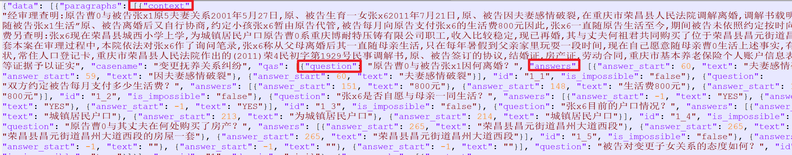
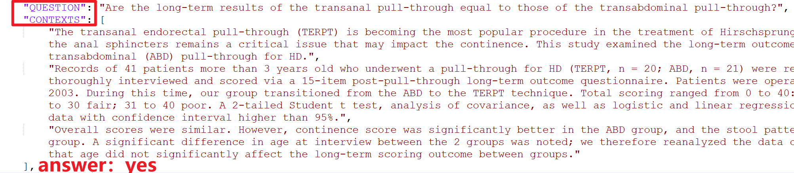

#### 一、hotpotQA：[HotpotQA Homepage](https://hotpotqa.github.io/)

1. 数据集链接：http://curtis.ml.cmu.edu/datasets/hotpot/hotpot_train_v1.1.json
2. 数据规模：训练集535M，测试集46M，开发集100M

3. 数据描述：HotpotQA 是一个问答数据集，具有自然的**多跳问题**，对支持事实进行强有力的监督，以实现更可解释的问答系统。
   它由卡内基梅隆大学、斯坦福大学和蒙特利尔大学的 NLP 研究人员团队收集。**【英文】**

4. 数据格式

 

---

#### 二、SQuAD2数据集：[[斯坦福问答数据集 (rajpurkar.github.io)](https://rajpurkar.github.io/SQuAD-explorer/)](https://rajpurkar.github.io/SQuAD-explorer/explore/v2.0/dev/Harvard_University.html)

1. 数据集链接：训练集[https://rajpurkar.github.io/SQuAD-explorer/dataset/train-v2.0.json]；开发集[https://rajpurkar.github.io/SQuAD-explorer/dataset/dev-v2.0.json]
2. 数据规模：15万+ QA对
3. 数据描述：**S**tanford **Qu**estion **A**nswering **D**ataset（SQuAD）是一个阅读理解数据集，由众包工作者在一组**维基百科**条目上提出的问题组成，其中每个问题的答案是相应阅读段落中的一段文本或*跨度*，或者问题可能无法回答。**【英文】【维基百科】**
4. 数据格式：

 

----

#### 三、NatualQuestions：https://ai.google.com/research/NaturalQuestions/visualization

1. 数据集链接：训练集[https://storage.cloud.google.com/natural_questions/v1.0-simplified/simplified-nq-train.jsonl.gz]、开发集[https://storage.cloud.google.com/natural_questions/v1.0-simplified/nq-dev-all.jsonl.gz]
2. 数据规模：41Gb 训练集、1GB开发集
3. 数据描述：NQ语料库包含来自真实用户的问题，它要求QA系统阅读和理解整个维基百科文章，其中可能包含也可能不包含问题的答案。包含真实的用户问题，以及解决方案应阅读整个页面以找到答案的要求，使 NQ 成为一项比以前的 QA 数据集更现实、更具挑战性的任务。**【维基百科】【英文】**

4. 数据格式：

 

---

#### 四、中文法律问答数据集：CAIL2019

1. 数据集链接：[CAIL2019/阅读理解/data at master · china-ai-law-challenge/CAIL2019 · GitHub](https://github.com/china-ai-law-challenge/CAIL2019/tree/master/阅读理解/data)
2. 数据规模：30m左右
3. 数据描述：数据集是来自“中国裁判文书网”公开的法律文书，主要涉及民事和刑事的一审判决书，总共约1万份数据，并按比例划分训练、开发和测试。每份数据包括若干个问题，对于训练集，每个问题只包含一个标准回答，对于开发和测试集，每个问题包含3个标准回答。回答内容可以是案情片段，可以是YES或NO，也可以拒答即回答内容为空。数据格式参考SquAD2.0的数据格式，整体为json格式的数据。并增设案由"casename"字段和领域"domain"字段，"domain"字段只有"civil"和"criminal"两种类型。"context"抽取自裁判文书的案情描述或原告诉称部分。**【裁判文书网】【中文】**
4. 数据格式：
   

----

#### 五、PubMedQA：医学问答数据集

1. 数据集链接：[PubMedQA Homepage](https://pubmedqa.github.io/)
2. 数据规模： 1k 个专家标记、61.2k 个未标记和 211.3k 个人工生成的 QA 实例。
3. 数据描述：PubMedQA的任务是使用相应的摘要回答是/否/也许的研究问题（例如：术前他汀类药物是否会减少冠状动脉旁路移植术后的心房颤动？
4. 数据格式：



----

#### 六、Qasper：[卡斯珀 (allenai.org)](https://allenai.org/project/qasper/home)

1. 数据集链接：https://qasper-dataset.s3.us-west-2.amazonaws.com/qasper-train-dev-v0.3.tgz
2. 数据规模：一个包含 1585 篇论文的数据集，其中包含 5049 个QA问题
3. 数据描述：一个包含 1585 篇论文的数据集，其中包含 5049 个QA问题
4. 数据格式

 

-----

#### 七、SciQ Dataset：科学问答数据集

1. 数据集链接：https://ai2-public-datasets.s3.amazonaws.com/sciq/SciQ.zip
2. 数据规模：不大
3. 数据描述：包含13679个关于物理，化学和生物学等的众包科学考试问题。这些问题采用多项选择题格式，每个选项有 4 个答案选项
4. 数据格式

```json
[
    {
        "question": "Compounds that are capable of accepting electrons, such as o 2 or f2, are called what?",
        "distractor3": "residues",
        "distractor1": "antioxidants",
        "distractor2": "Oxygen",
        "correct_answer": "oxidants",
        "support": "Oxidants and Reductants Compounds that are capable of accepting electrons, such as O 2 or F2, are calledoxidants (or oxidizing agents) because they can oxidize other compounds. In the process of accepting electrons, an oxidant is reduced. Compounds that are capable of donating electrons, such as sodium metal or cyclohexane (C6H12), are calledreductants (or reducing agents) because they can cause the reduction of another compound. In the process of donating electrons, a reductant is oxidized. These relationships are summarized in Equation 3.30: Equation 3.30 Saylor URL: http://www. saylor. org/books."
    }
]
```

#### 八、其他公开领域的数据集链接：

1. [知识类问答数据集资源对外开放：百万级百度知道、社区问答及六大领域级小规模语料概述](https://zhuanlan.zhihu.com/p/609821974)
2. [千言（LUGE）| 全面的中文开源数据集合](https://www.luge.ai/#/)

 

3. Dureader：一个大规模的中文阅读理解数据集，包含三个子任务：机器阅读理解、搜索式问答和多文档阅读理解。数据来源于百度搜索引擎和百度知道。**【百度】【中文】**[Machine Reading Comprehension - 飞桨AI Studio (baidu.com)](https://aistudio.baidu.com/aistudio/datasetdetail/177185/1)

4. WebQuestions：一个开放领域问答数据集，包含5,810个问题和答案，基于Google Suggest API生成的问题和Freebase实体作为答案。[WebQuestions Benchmark for Question Answering (codalab.org)](https://worksheets.codalab.org/worksheets/0xba659fe363cb46e7a505c5b6a774dc8a)
5. **TriviaQA**：一个问答数据集，包含65万多个问题和答案，基于维基百科和网络搜索结果。每个问题都是一个有趣的事实，每个答案都是一个实体或数字。http://nlp.cs.washington.edu/triviaqa/

----

#### 九、ChatGPT使用的训练数据集——来自bing

chatGPT是一个基于GPT-3的对话生成模型，使用了OpenAI API提供的数据集和模型来训练。根据OpenAI API的文档，chatGPT使用的训练数据集有：
	cc_sbu_align：一个包含4K个对话的数据集，基于MiniGPT-4数据集。
	blended_skill_talk：一个包含7K个对话的数据集，设计为展示多种对话模式，如展示个性、表达同理心和展示知识。
	GSM-IC：一个包含8K个对话的数据集，涉及到小学数学问题和无关上下文。
	ChatAlpaca：一个包含10K个对话的数据集，由ChatGPT生成。
	Dolly：一个包含15K个对话的数据集，由Databricks员工生成，用于训练大型语言模型。
	WebGPT：一个包含20K个对话的数据集，由WebGPT项目生成。
	Code Alpaca：一个包含20K个代码生成任务的数据集。
	HC3：一个包含37K个指令的数据集，由ChatGPT和人类生成，涉及中英文。
	Alpaca Dataset：一个包含52K个指令的数据集，由OpenAI API提供。
	Finance：一个包含69K个金融相关指令的数据集。
	evol：一个包含70K个对话的数据集，是WizardLM的训练数据。
	Vicuna Dataset：一个包含75K个对话的数据集，基于ShareGPT对话。
	InstructionTranslation：一个包含80K个多语言指令翻译任务的数据集，由M2M 12B生成。
	Self-Instruct：一个包含82K个指令输入输出实例的数据集。
	OASST1：一个包含89K个多语言助理风格对话的数据集，由人类生成和标注。
	HH-RLHF：一个包含91K个对话的数据集，用于从人类反馈中进行强化学习。

---

todo——构建数据集：构建retrieval数据集；匹配模型优化——对比学习预训练、度量学习；大模型prompt【用户查询】

根据已有的样本，摘要喂给GPT4进行self-instruct
