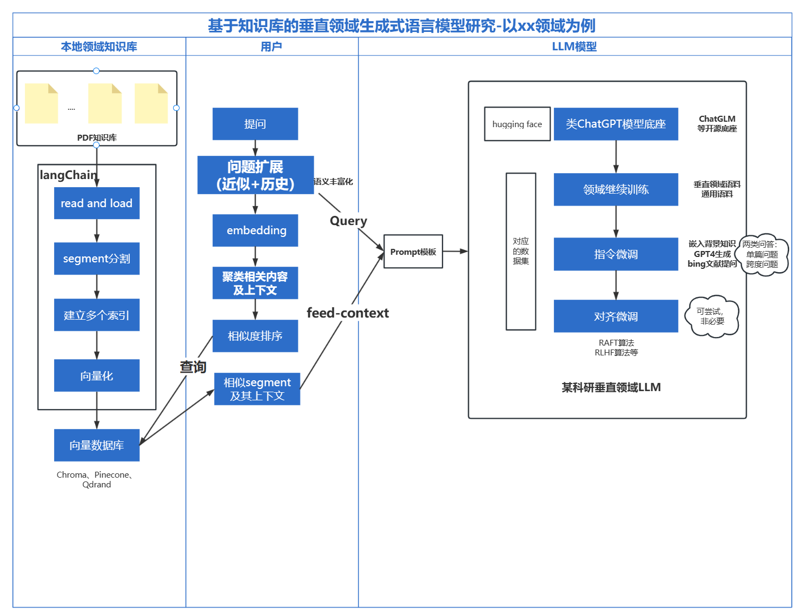

#### 技术框架整体图

 

##### 二、解释

1. **本地领域知识库部分：**由于token长度限制问题，所以需要将多个pdf进行拆分成段落（segment），然后利用langChain+FAISS向量库建立向量数据库和文档索引。

2. **用户提问部分：**将用户提出的query进行同义词+历史信息扩充，然后选取目前词嵌入效果最佳的相关embedding模型进行词向量建模，将得到的词向量与本地知识库的向量数据库进行匹配检索，将匹配结果进行聚类，扩充得到与该问题相关的更全回答信息，并基于相似度进行排序得到喂给LLM模型的信息。

3. ##### LLM模型：

（1）input：Prompt[用户提问+相关检索信息]
（2）output：带有标引信息的回答结果
（3）垂直领域LLM模型微调部分：根据已有的开源微调项目进行改动、参考
		①选取某一领域
		②继续训练部分：无监督学习
		③**关键：指令微调部分：**构建高质量的领域问答数据集。
										分为两类：针对单篇事实性问题进行总结的问答数据集（bing等ChatPDF工具进行文档提问）
															更为宽泛、总结性的跨篇章问答数据集（GPT自生成）
		④对齐微调：符合用户价值观和说话习惯等（主要借鉴LMFlow项目尝试开展，不是必做项）

